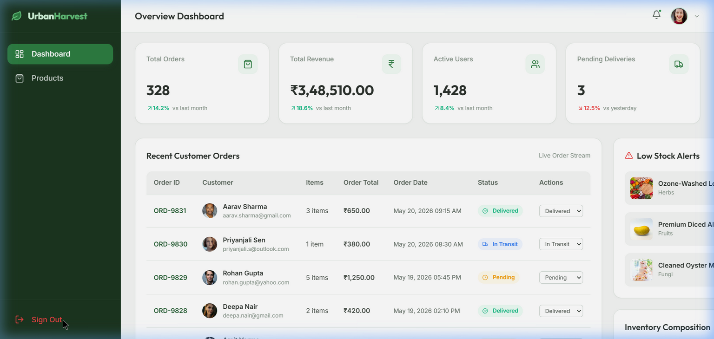

# Urban Harvest Admin Dashboard

A responsive, modern, and user-friendly administrative dashboard for **Urban Harvest**—a fictional urban agriculture and fresh organic food delivery platform. Developed as part of the UI/UX Developer Fresher assignment.



## 🌟 Key Features

### 1. Modern Login Page (`/login`)
- **Visual Design**: Split-screen design featuring a green brand panel and a clean form card.
- **Autofill Helper**: Quick credentials tooltip highlighting test values.
- **Form Controls**: Password visibility toggle, modern form input focus shadows, and custom remember-me checkbox.
- **Simulated Latency**: Built-in visual loaders representing asynchronous authentication processes.
- **Error Feedback**: Red alert banner highlighting validation failures.

### 2. Comprehensive Overview Dashboard (`/dashboard`)
- **Reactive Stats Cards**:
  - **Total Orders**: Live count of global orders.
  - **Revenue**: Live summation of Delivered and In Transit orders.
  - **Active Users**: Customer engagement index metrics.
  - **Pending Deliveries**: Live count of active dispatches.
- **Recent Customer Orders Table**:
  - Full display of ID, Avatar, name, email, item counts, total, date, status badges.
  - **Interactive Action Dropdown**: Transition order statuses (e.g. from *Pending* to *Delivered*) directly from the table and watch the Total Revenue and Pending Deliveries metrics update in real-time.
- **Low Stock Feed**: Highlights items running low (stock <= 5) with a quick action button to immediately restock.
- **Composition Graph**: Dynamic visual progress bars categorizing inventory percentages.

### 3. Product Inventory Management (`/products`)
- **Create Product Drawer**: Modal with inputs for name, category selection, price, custom packaging unit, stock, and descriptions. Validations ensure all fields are correct.
- **Category Filter Navigation**: Horizontal scroll navigation pills to filter inventory by categories (Vegetables, Fruits, Herbs, Microgreens, Fungi).
- **Search & Status Filters**: Search by name or description instantly, and filter by availability.
- **Stock Management Actions**: Individual switches to toggle items between *Available* (stock set to 15) and *Out of Stock* (stock set to 0), synchronizing low stock alerts immediately on the main dashboard.

---

## 🛠️ Technology Stack
- **Frontend Engine**: React JS (v19) via Vite
- **State Architecture**: Redux Toolkit & React-Redux (v9)
- **Routing Engine**: React Router DOM (v7)
- **Design & Icons**: Lucide React
- **Styling**: Responsive Vanilla CSS Custom Grid Layouts

---

## 📂 Folder Structure
```text
src/
├── components/          # Reusable components
│   ├── Header.jsx       # Navigation header & profile dropdown
│   ├── Sidebar.jsx      # Navigation sidebar & responsive mobile overlay
│   ├── StatCard.jsx     # Overview metrics card
│   ├── Modal.jsx        # Popups container
│   └── layout.css       # Core layout styling
├── store/               # Redux state configuration
│   ├── store.js         # Main store configuration
│   ├── authSlice.js     # User authentication actions
│   ├── productSlice.js  # Inventory actions & filtering selectors
│   └── orderSlice.js    # Customer orders & analytics selectors
├── pages/               # Main route views
│   ├── LoginPage.jsx    # Login interface
│   ├── DashboardPage.jsx# Analytical reports page
│   ├── ProductPage.jsx  # Inventory controls page
│   └── pages.css        # Page-level stylesheet
├── App.jsx              # Routing rules & layout guards
├── index.css            # Custom CSS variables, scrollbars & tokens
└── main.jsx             # Entry mount point & provider wrappers
```

---

## 🚀 Local Installation & Setup

1. **Clone the repository**:
   ```bash
   git clone <repository-url>
   cd urbanharvest_dashboard
   ```

2. **Install dependencies**:
   ```bash
   npm install --legacy-peer-deps
   ```

3. **Launch the local development server**:
   ```bash
   npm run dev
   ```
   Open `http://localhost:5173/` in your browser.

4. **Test Credentials**:
   - **Email**: `admin@urbanharvest.com`
   - **Password**: `admin123`

5. **Build for production**:
   ```bash
   npm run build
   ```
