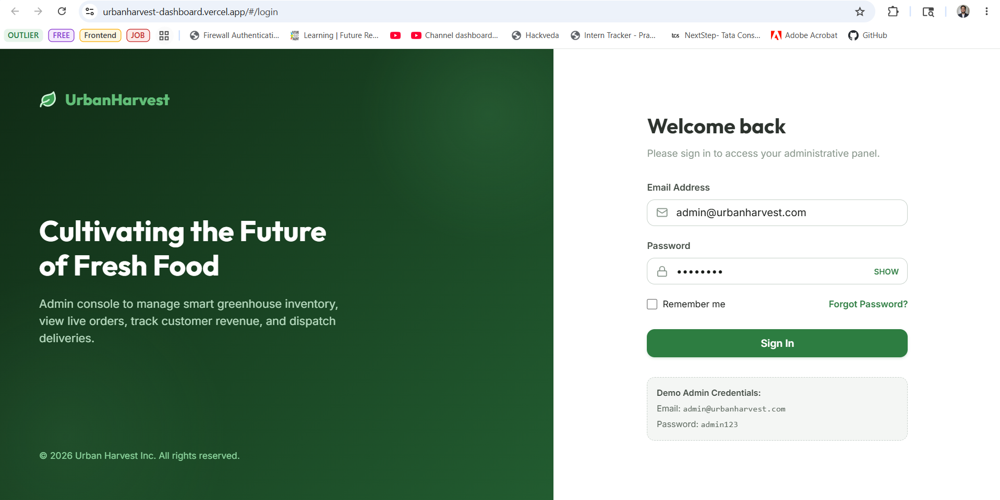
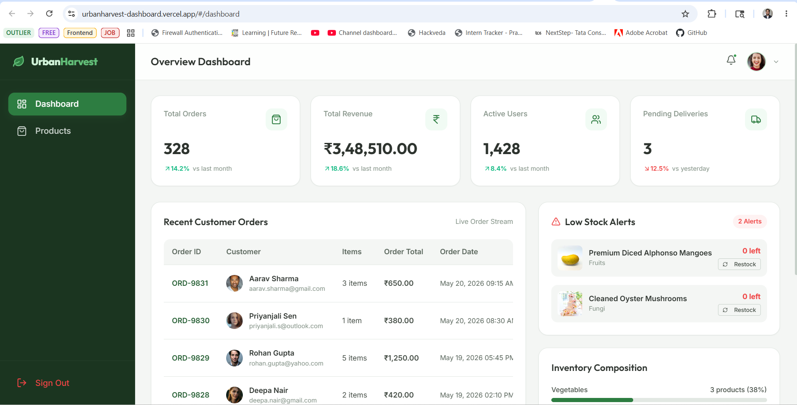
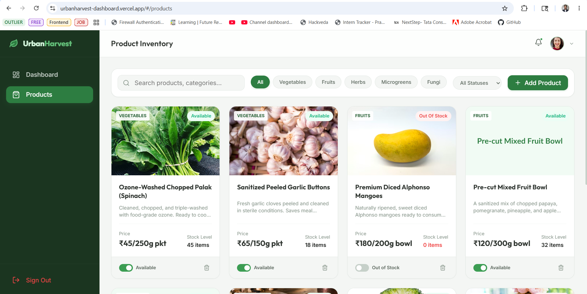
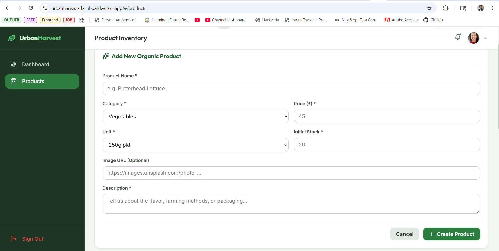
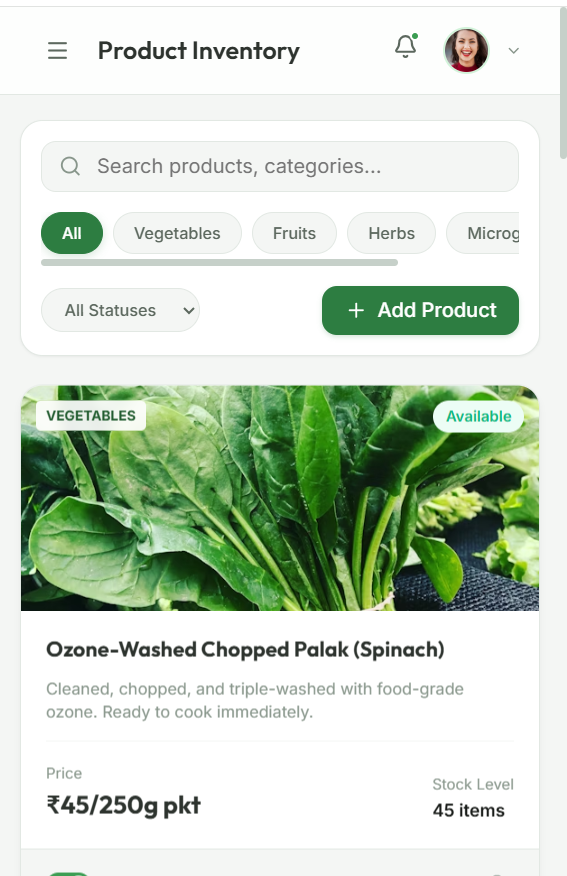
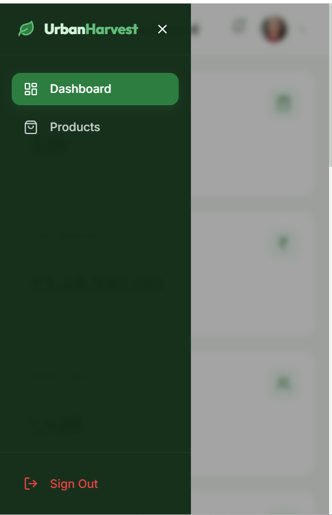

# Urban Harvest Dashboard

> A responsive, modern, and user-friendly administrative dashboard for **Urban Harvest**—a fictional urban agriculture and fresh organic food delivery platform. Developed as part of the UI/UX Developer assignment.

## Live Links

- **Working Demo (Vercel)**: `https://urbanharvest-dashboard.vercel.app/`
- **GitHub Repository**: `https://github.com/PrabhavRathi06/urbanharvest_dashboard`

---

## 📸 Project Showcase & Screenshots

### 1. Administrative Login Page
Clean, modern split-screen layout with form validation, test credentials helper, and remember-me functionality.


### 2. Analytics Overview Dashboard
Interactive panels featuring live order stats, revenue aggregations, recent orders list, inventory composition status, and low stock alerts feed.


### 3. Product Inventory Management (Desktop)
Search bar, filter by category pills, stock/availability status control switches, and action triggers.


### 4. Create Product Inline Form
A collapsible inline form panel to seamlessly add new inventory items with input validation.


### 5. Mobile Responsive View (Product Page)
Compact, mobile-optimized card styling and filters that fit perfectly on narrow screen sizes.


### 6. Mobile Side Menu Drawer
Clean mobile navigation menu drawer that transitions smoothly from offscreen.


---

## Features

- **Modern Login Experience:** Clean split-screen design with dynamic brand pane, remember-me support, password visibility toggle, and instant login authentication validation.
- **Real-Time Overview Analytics:** Stat cards displaying Total Orders, Revenue, Active Users, and Pending Deliveries that dynamically recalculate and synchronize as orders change status.
- **Recent Orders Management:** Responsive interactive orders table supporting live status transitions (Pending, In Transit, Delivered, Cancelled) with horizontal swipe/scroll capabilities for mobile screen sizes.
- **Low Stock Intelligence Feed:** Highlights products running low on stock (stock <= 5) with a single-click restock option to quickly replenish items to healthy inventory levels.
- **Inventory Composition Graph:** Live visual breakdowns of inventory percentages by categories with harmonized color-coded progress bars.
- **Product Inventory Controls:** Search by product name or description, filter by category pills, status criteria, and easily delete items from the dashboard.
- **Inline Collapsible Form:** Add new organic products through an elegant inline form panel right above the product grid, complete with form validation, category mapping, and pricing units.
- **Basic Animations & Hover Micro-interactions:** Fluid scale-in and fade-in states, custom toggle switch transitions, and card lift-ups.

---

## Technology Stack

| Layer | Technology |
|-------|-----------|
| **Core Framework** | React JS 19 |
| **State Management** | Redux Toolkit & React-Redux (v9) |
| **Routing Engine** | React Router DOM (v7) |
| **Icons & Design** | Lucide React |
| **Styling** | Responsive Vanilla CSS & Custom CSS Custom Grid Layouts |
| **Build Tooling** | Vite |

---

## Project Structure

```text
urbanharvest_dashboard/
├── src/
│   ├── components/          # Reusable UI components
│   │   ├── Header.jsx       # Top navigation header & profile dropdown
│   │   ├── Sidebar.jsx      # Fixed navigation sidebar & responsive mobile overlay
│   │   ├── StatCard.jsx     # Overview metrics card
│   │   ├── Modal.jsx        # Popups container
│   │   └── layout.css       # Core layout styling
│   ├── store/               # Redux state configuration
│   │   ├── store.js         # Main store configuration
│   │   ├── authSlice.js     # User authentication actions & state
│   │   ├── productSlice.js  # Inventory actions & filtering selectors
│   │   └── orderSlice.js    # Customer orders & analytics selectors
│   ├── pages/               # Main route views
│   │   ├── LoginPage.jsx    # Login interface
│   │   ├── DashboardPage.jsx# Analytical reports page
│   │   ├── ProductPage.jsx  # Inventory controls page
│   │   └── pages.css        # Page-level stylesheet
│   ├── App.jsx              # Routing rules & layout guards
│   ├── index.css            # Custom CSS variables, scrollbars & tokens
│   └── main.jsx             # Entry mount point & provider wrappers
```

---

## Local Setup Instructions

### Prerequisites
- Node.js 18+
- npm or yarn

### 1. Installation
```bash
# Clone the repository
git clone https://github.com/PrabhavRathi06/urbanharvest_dashboard.git
cd urbanharvest_dashboard

# Install required dependencies
npm install
```

### 2. Launch Development Server
```bash
# Run local dev server
npm run dev
```
> **Local App URL:** `http://localhost:5173/`

### 3. Demo Credentials
- **Email**: `admin@urbanharvest.com`
- **Password**: `admin123`

### 4. Build for Production
```bash
# Compile and build bundle
npm run build
```

---
*Built for Urban Harvest UI/UX Freshers Evaluation.*
